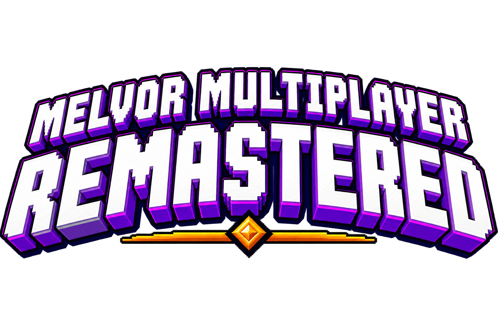

# Melvor Multiplayer Remastered

A 2026 remaster of Melvor Multiplayer. Bring your Melvor characters into a shared world: join a Guild to chat, trade,
pursue collective goals, face Guild Raids, and shape your community together.

## Features

- Group chat, private chat, in-app support chat.
- Public and private Guilds, or the Free Fellowship.
- Trading, gifting, the Marketplace, and Charitree.
- Cooperative Campaigns and Guild Raids.
- Showing off profiles for equipment, skill levels, GP, and current activity.
- Guild Council petitions, so members can shape their Guild together.

## Getting started

1. Disable the original Melvor Multiplayer mod, if it is enabled.
2. Enable this mod and reload the game.
3. Open a save and join or create a Guild.

## Run a self-hosted server

If you'd like to connect the mod to your own private server, you can do so quite easily.

Docker and Docker Compose are the only host prerequisites. Optionally copy `.env.example` to `.env`, then run:

```sh
docker compose up --build --wait
```

The server listens at `http://127.0.0.1:3000` by default. Stop it with:

```sh
docker compose down
```

The SQLite database is stored in the `database-data` Docker volume. Add `--volumes` only when you want to remove that
local data.

## Build the local mod

This isn't necessary to connect to your private server. Use only if you want to make modifications to the mod itself.

Create a Creator Toolkit-ready ZIP from the checked-in loopback development client:

```sh
./scripts/package-mod.sh
```

Import `dist/melvor-multiplayer-local.zip` through Melvor's Creator Toolkit, enable it in a dedicated mod profile, and
reload the game. Disable the original Melvor Multiplayer mod in that profile so both clients do not run together.

To connect to another compatible server, open this mod under **Mod Settings**, set an HTTPS server origin under
**Connection**, and fully reload Melvor. HTTP overrides are accepted only for loopback development servers. Connect
only to operators you trust with the multiplayer identity and gameplay data sent through the mod.

## Validate the source

Run the complete server suite:

```sh
./scripts/test.sh
```

Run the client tests:

```sh
node --test tests/mod/*.test.mjs
```

Run the fresh-stack smoke test:

```sh
./scripts/smoke-test.sh
```

## Compatibility and privacy

Supports Melvor Idle v1.3.1 on iOS, Android, Desktop, and Browser. The service may undergo maintenance without notice.

The server stores the multiplayer data needed to provide these features, including Guild data, shared Player Status,
the latest reported player language, and Messages. Deleted Messages and conversations are removed only from your view.
Request logs are retained for seven days. New clients report a random, server-scoped installation ID and coarse
platform/engine labels. Optional app distribution (including Huawei AppGallery), stable/beta channel, app version,
and build are explicitly player-reported, not inferred from the phone brand. These labels accompany authenticated
request logs; origin categories, recognized preflight header names, and rejection reasons help diagnose transport
failures. The operator retains up to 32 latest installation records per Client, with first/last authentication times; those records are erased when the Client is deleted.
Diagnostics exclude IP addresses, raw user agents, device names, credentials, and request bodies. Mod Settings includes
a local, 50-request connection report that can be copied even when connection fails; it is not uploaded automatically.

New servers enroll a separate installation credential in device-local storage after a successful connection.
Credential hashes and revocation state remain with the retained Client to support recovery after soft deletion;
they are never included in diagnostic reports. Different installations may stay connected simultaneously; reconnecting an installation replaces only its own
previous session. Keep your Melvor saves synchronized: last-save overwrite does not reverse trades or other shared
server changes made from another copy, and unacknowledged character-owned deliveries may reach both copies. Installation revocation does not revoke the save-carried identity proof:
anyone holding that proof may enroll another installation. Do not share saves containing multiplayer credentials.
Older servers continue using the save credential and cannot enforce installation revocation.

## Attribution

> Melvor Multiplayer 2026 is an unofficial, community-maintained fork of [Melvor Multiplayer](https://mod.io/g/melvoridle/m/melvor-multiplayer), originally created by **Kruithne**. It is not affiliated with or endorsed by the original author, Games by Malcs, or Jagex.
